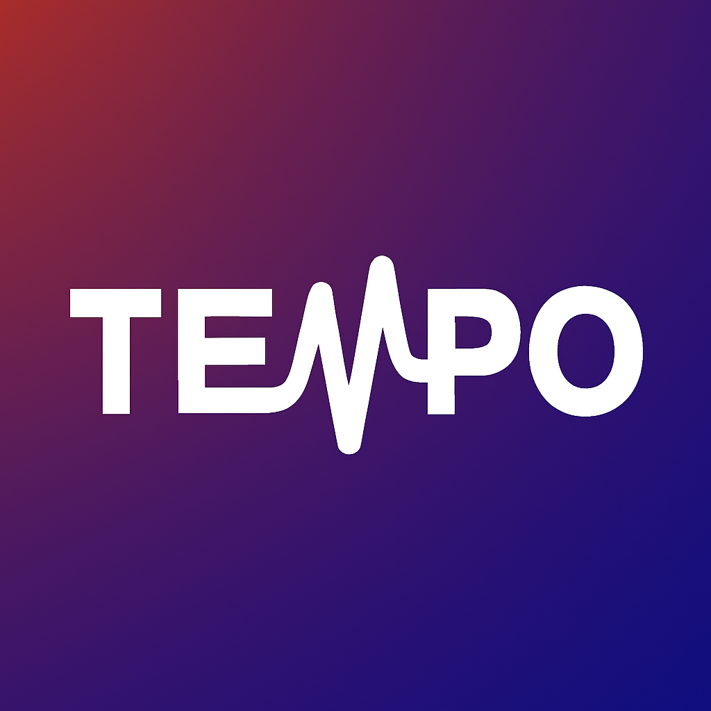

# Tempo

  

  

 
 

 

**Tempo** is a local-first music journal and scrobbler for Android. It runs in the background, tracks playback across audio players, and generates listening statistics, interactive charts, and shareable spotlight cards.

All data is stored locally in an on-device SQLite database without cloud account requirements.

---

## Screenshots

  
  
  
  

  
  
  
  

---

## Features

### Listening Statistics
- **Item Analytics**: Displays heatmaps, timelines, and metrics for individual songs, artists, and albums.
- **Listening Quality Score (LQS)**: Calculates engagement scores based on playback duration, replays, seeks, and skips.
- **Audio Metadata**: Tracks valence, energy, and danceability values for played tracks.

### Spotlight Visualizations
Generates shareable image cards rendered using Jetpack Compose Canvas:
- **Circadian Rhythm**: A 24-hour radial chart mapping peak listening times.
- **Weekly Pulse**: An isometric layout comparing weekday and weekend playback.
- **Forgotten Favorite**: Highlights songs unplayed over extended periods with days elapsed.
- **Sonic Immersion**: A visual tunnel representation of continuous listening sessions.
- **Seasonal Poetry**: Hemisphere-aware summary text based on monthly statistics.

### Background Tracking
- Captures playback events from Spotify, YouTube Music, Apple Music, Poweramp, and 50+ Android audio players using `NotificationListenerService`.
- Filters system notifications, podcasts, and audiobooks from music statistics.

### Browser Sync
Syncs browser playback to the phone over the local network:
- **Browser Extension**: Companion extension reading HTML audio timestamps and tab URLs on supported web players (YouTube Music, Spotify, SoundCloud).
- **Local Pairing**: Connects over Wi-Fi using HMAC-SHA256 request signatures.

### Home Screen Widgets
- **Glance Widgets**: 7 Android widgets displaying heatmaps, now-playing tracks, progress milestones, and recommendations.

### Data Import & Integrations
- **Last.fm Import**: Imports listening history into active analytics storage while archiving older entries to conserve memory.
- **Spotify API**: Fetches track audio features (energy, valence, danceability).
- **API-Only Mode**: Disables background notification listener and polls Spotify directly to reduce battery consumption.

### Milestones & Titles
- **XP & Levels**: Grants XP based on listening time and track engagement.
- **Titles**: Unlocks titles based on user level and genre variety.
- **Daily Tasks**: Generates daily goals (e.g. listening for 30 minutes without skips) for bonus XP.
- **Badges**: Awards badges for milestone scrobble totals and listening hours.

### Play Verification & Background Execution
- **Anti-Spam Filter**: Ignores rapid consecutive loops of short tracks.
- **Mute Detection**: Pauses scrobbling and XP tracking when media volume is muted.
- **Background Keep-Alive**: Uses foreground services and provides setup steps for aggressive vendor battery limits (HyperOS, MIUI).

### Architecture & Storage
- **Offline Storage**: Uses Room SQLite for local database persistence without external servers.
- **Encrypted Credentials**: Stores API tokens in Android `EncryptedSharedPreferences`.
- **Google Drive Backup**: Saves encrypted database backups directly to user Google Drive storage.

---

## Tech Stack

| Layer | Technology |
| :--- | :--- |
| **Languages** | Kotlin (Jetpack Compose) |
| **Architecture** | MVVM + Clean Architecture, Hilt |
| **Database** | Room SQLite, DataStore, EncryptedSharedPreferences |
| **Networking** | Retrofit, OkHttp |
| **Background Services** | WorkManager, Foreground Services |
| **UI & Charts** | Jetpack Glance, Vico, MPAndroidChart |
| **Image Loading** | Coil |
| **Browser Extension** | TypeScript (Manifest V3) |
| **SDK Targets** | Min SDK 26 (Android 8.0) / Target SDK 36 (Android 16) |

---

## Contributing

Contributions are welcome. Before making major changes, open an issue to discuss proposed modifications.
- **Bug Fixes**: Submit a pull request directly.
- **Documentation**: Improvements to guides and comments are encouraged.

See [CONTRIBUTION.md](CONTRIBUTION.md) for details.

---

## License

Tempo is released under a **custom modified AGPLv3 License**.

- **Permitted**: Code inspection, personal builds, security audits, and pull requests.
- **Prohibited**: Commercial sales, monetized redistribution, and publishing modified builds to app marketplaces.

See [LICENSE](LICENSE) for terms.

---

## Author

Maintained by [Avinash](https://github.com/avinaxhroy)
